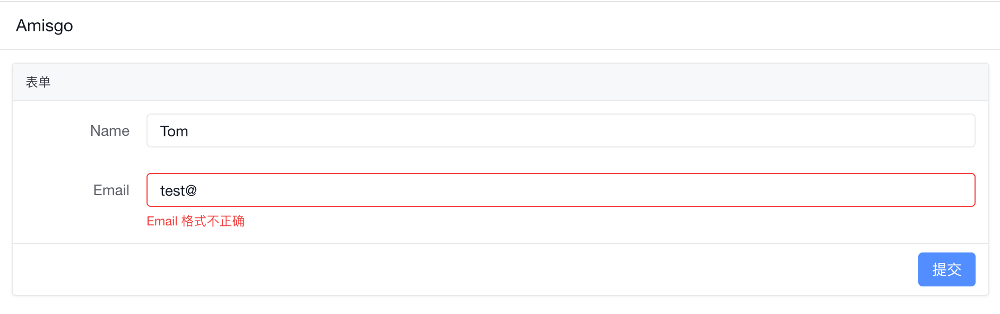

# Amisgo

Amisgo is a low code frontend framework for gophers.  
The name stands for `amis go`, coincidentally means `friend` in Zulu.

## Inspired by

Amisgo is inspired by and based on baidu [Amis](https://aisuda.bce.baidu.com/amis).  
Read the [wiki](https://github.com/zrcoder/amisgo/wiki)(Chinese) and [discussions](https://github.com/zrcoder/amisgo/discussions) for more background and details.

## Usage

Hello world

```go
package main

import (
	"github.com/zrcoder/amisgo"
	"github.com/zrcoder/amisgo/comp"
)

func main() {
	index := comp.Page().Title("Amisgo").Body(
		comp.Form().Mode("horizontal").Body(
			comp.InputText().Label("Name").Name("name"),
			comp.InputEmail().Label("Email").Name("email"),
		),
	)

	amisgo.Route("/", index)
	panic(amisgo.ListenAndServe(":9090"))
}
```

and then visit http://localhost:9090 , you will see a page like this:



## TODO

- [x] both ListenAndServe, GenerateStaticWebsite api
- [x] Generate codes in the comp directory, based on schema.json in Amis' last release(or Amis' docs)
- [ ] Tests and examples
- [ ] Go+ classfile improvement
